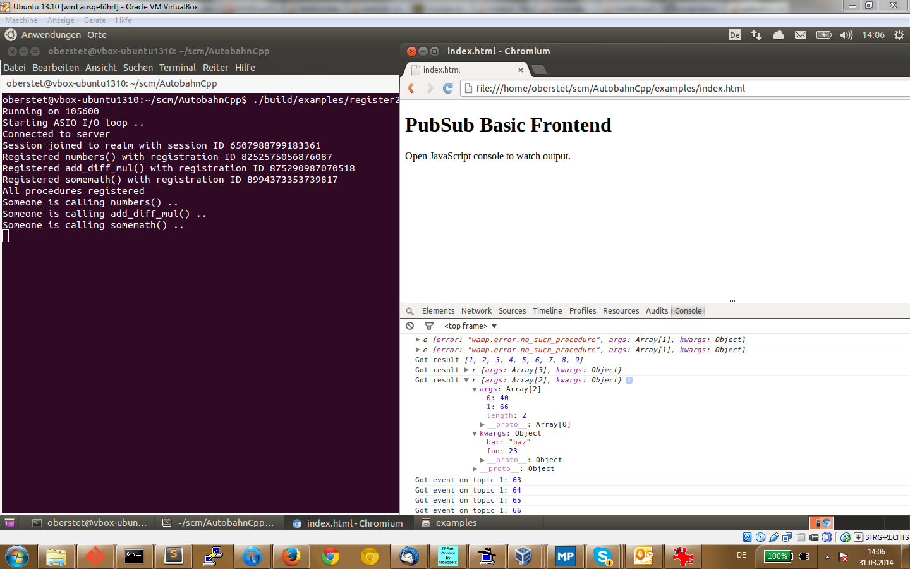

# **Autobahn**|Cpp

**Autobahn**|Cpp is a subproject of [Autobahn](http://autobahn.ws/) which implements the [Web Application Messaging Protocol (WAMP)](http://wamp.ws/) in C++ supporting the following application roles

 * **Caller**
 * **Callee**
 * **Publisher**
 * **Subscriber**

The API and implementation make use of modern C++ 11 and new asynchronous idioms using (upcoming) features of the standard C++ library, in particular **Futures**, [**Continuations**](http://www.open-std.org/jtc1/sc22/wg21/docs/papers/2013/n3634.pdf) and **Lambdas**.

> [Continuations](http://en.wikipedia.org/wiki/Continuation) are *one* way of managing control flow in an asynchronous program. Other styles include: asynchronous [Callbacks](http://en.wikipedia.org/wiki/Callback_%28computer_programming%29), [Coroutines](http://en.wikipedia.org/wiki/Coroutine) (`yield` or `await`), Actors ([Erlang/OTP](http://www.erlang.org/), [Scala](http://www.scala-lang.org/)/[Akka](http://akka.io/) or [Rust](http://www.scala-lang.org/)) and [Transactional memory](http://en.wikipedia.org/wiki/Transactional_Synchronization_Extensions).
>

**Autobahn**|Cpp supports running WAMP (`rawsocket-msgpack`) over **TCP(-TLS)**, **Unix domain sockets** or **pipes** (`stdio`). The library is "header-only", light-weight (< 2k code lines) and **depends on** the following:

 * C++11 compiler
 * [`boost::future`](http://www.boost.org/doc/libs/1_56_0/doc/html/thread/synchronization.html#thread.synchronization.futures)
 * [`boost::asio`](http://www.boost.org/doc/libs/1_56_0/doc/html/boost_asio.html)
 * [msgpack-c](https://github.com/msgpack/msgpack-c)

For getting help, questions or feedback, get in touch on the **[mailing list](https://groups.google.com/forum/#!forum/autobahnws)**, **[Twitter](https://twitter.com/autobahnws)** or **IRC `#autobahn`** (Freenode).


## Show me some code!

Here is how programming with C++ and **Autobahn**|Cpp looks like.

**Calling a remote Procedure**

```c++
auto c1 = session.call("com.mathservice.add2", std::make_tuple(23, 777))
    .then([&](boost::future<wamp_call_result> result) {
        std::cout << "Got call result " << result.get().argument<uint64_t>(0) << std::endl;
    });
```

**Registering a remoted Procedure**
```c++
auto r1 = session.provide("com.myapp.cpp.square",
    [](autobahn::wamp_invocation invocation) {
        std::cout << "Procedure is invoked .." << endl;
        uint64_t x = invocation->argument<uint64_t>(0);
        return x * x;
    })
    .then([](boost::future<autobahn::wamp_registration> reg) {
        std::cout << "Registered with ID " << reg.get().id() << std::endl;
    });
```

**Publishing an Event**

```c++
session.publish("com.myapp.topic2", std::make_tuple(23, true, std::string("hello")));
```

**Publishing an Event (acknowledged)**

```c++
auto opts = PublishOptions();
opts.acknowledge = True;

session.publish("com.myapp.topic2", std::make_tuple(23, true, std::string("hello")), opts)
    .then([](boost::future<autobahn::wamp_publication> pub) {
        std::cout << "Published with ID " << pub.get().id() << std::endl;
    });
```

**Subscribing to a Topic**

```c++
auto s1 = session.subscribe("com.myapp.topic1",
    [](const autobahn::wamp_event& event) {
        std::cout << "Got event: " << event.argument<uint64_t>(0) << std::endl;
    })
    .then([](boost::future<autobahn::wamp_subscription> sub) {
        std::cout << "Subscribed with ID " << sub.get().id() << std::endl;
    });
```


Here is JavaScript running in Chrome call into C++ running on command line. Both are connected via a WAMP router, in this case [**Autobahn**|Python](http://autobahn.ws/python) based.



* [Example C++ code](https://github.com/davidchappelle/AutobahnCpp/blob/master/examples/register2.cpp)
* [Example JavaScript code](https://github.com/tavendo/AutobahnCpp/blob/master/examples/index.html)

## Building

> *Notes*
>
> * The library code is written in standard C++ 11. Target toolchains currently include **clang** and **gcc**. Support for MSVC is tracked on this [issue](https://github.com/tavendo/AutobahnCpp/issues/2).
> * While C++ 11 includes `std::future` in the standard library, this lacks continuations. `boost::future.then` allows attaching continuations to futures as outlined in the proposal [here](http://www.open-std.org/jtc1/sc22/wg21/docs/papers/2013/n3634.pdf). This feature will come to standard C++, but probably not before 2017 (see [C++ Standardisation Roadmap](http://isocpp.org/std/status))
> * Support for `when_all` and `when_any` as described in above proposal depends on Boost 1.56 or higher.
> * The library and example programs were tested and developed with **clang 3.4**, **libc++** and **Boost trunk/1.56** on an Ubuntu 13.10 x86-64 bit system. It also works with **gcc 4.8**, **libstdc++** and **Boost trunk/1.56**. Your mileage with other versions of the former may vary, but we accept PRs;)


### Build tools

Install some libs and build tools (these are for Ubuntu):

```console
sudo apt-get install libbz2-dev libssl-dev cmake
```

### Clang

If you want to work with Clang (rather than GCC), install [clang](http://clang.llvm.org/) and [libc++](http://libcxx.llvm.org/) (these are for Ubuntu):

```console
sudo apt-get install clang libc++1 libc++-dev
sudo update-alternatives --config c++
# select clang++ in command-line interface
```

### Boost

Most of the time, your distro's Boost libraries will be outdated (unless you're using Arch or Homebrew). Don't waste time with those: to build the latest Boost 1.58 (current release as of 2015/06) from sources

```console
cd ~
wget http://downloads.sourceforge.net/project/boost/boost/1.58.0/boost_1_58_0.tar.bz2
tar xvjf boost_1_58_0.tar.bz2
cd boost_1_58_0
./bootstrap.sh --with-toolset=clang
./b2 toolset=clang cxxflags="-stdlib=libc++" linkflags="-stdlib=libc++" -j 4
```

> Note: The `-j 4` option will allow use of 4 cores for building.
>

To build using GCC instead of Clang:

```console
./bootstrap.sh --with-toolset=gcc
./b2 toolset=gcc -j 4
```

### MsgPack-C

Get [MsgPack-C](https://github.com/msgpack/msgpack-c) and install:

```console
cd $HOME
git clone https://github.com/msgpack/msgpack-c.git
cd msgpack-c
git checkout cpp-1.1.0
mkdir -p ../build/msgpack-c
cd ../build/msgpack-c
cmake ${HOME}/msgpack-c
make
make install
```

> On FreeBSD, you need to `pkg install autotools` and invoke `gmake` instead of `make`.

### **Autobahn**|Cpp

To get **Autobahn**|Cpp library and examples, clone the repo

```console
cd $HOME
git clone git@github.com:davidchappelle/AutobahnCpp.git autobahn
cd autobahn
```

The library is "header-only", means there isn't anything to compile or build. Just include the relevant headers.


## Examples

The Autobahn|Cpp repository contains a number of [examples](https://github.com/tavendo/AutobahnCpp/tree/master/examples) that demonstrate all 4 basic patterns of using WAMP:

* [Call 1](https://github.com/davidchappelle/AutobahnCpp/blob/master/examples/call1.cpp)
* [Call 2](https://github.com/davidchappelle/AutobahnCpp/blob/master/examples/call2.cpp)
* [Call 3](https://github.com/davidchappelle/AutobahnCpp/blob/master/examples/call3.cpp)
* [Register 1](https://github.com/davidchappelle/AutobahnCpp/blob/master/examples/register1.cpp)
* [Register 2](https://github.com/davidchappelle/AutobahnCpp/blob/master/examples/register2.cpp)
* [Publish 1](https://github.com/davidchappelle/AutobahnCpp/blob/master/examples/publish1.cpp)
* [Publish 2](https://github.com/davidchappelle/AutobahnCpp/blob/master/examples/publish2.cpp)
* [Publish 3](https://github.com/davidchappelle/AutobahnCpp/blob/master/examples/publish3.cpp)
* [Subscribe 1](https://github.com/davidchappelle/AutobahnCpp/blob/master/examples/subscribe1.cpp)


### Building the Examples

For building the examples, add the following to your `~/.profile`:

```console
export BOOST_ROOT=${HOME}/boost
```

Now build all examples:

```console
mkdir -p ${HOME}/build/autobahn
cd ${HOME}/build/autobahn
cmake ${HOME}/autobahn
make -j4
```

The examples will get built in `build/autobahn/examples`.


### Running the Examples

The examples include a [Autobahn|Python](http://autobahn.ws/python) based WAMP router and example backend.

To run this, you need [Python](http://python.org) and [pip](http://www.pip-installer.org/en/latest/installing.html) already installed.

Then, to install **Autobahn|Python**

```console
pip install autobahn[twisted]
```

Start the [Crossbar hello:cpp example](https://github.com/crossbario/crossbarexamples/tree/master/hello/cpp) router in a first terminal

```console
cd $CROSSBAR_EXAMPLES/hello/cpp
crossbar start
```

Then start one of the built C++ examples in a second terminal

```console
cd ${HOME}/build/autobahn
./examples/call1
```


## Documentation

[Click here](http://autobahn.ws/cpp/reference/) for the Autobahn|Cpp reference documentation.

## Get in touch

Get in touch on IRC `#autobahn` on `chat.freenode.net`, follow us on [Twitter](https://twitter.com/autobahnws) or join the [mailing list](http://groups.google.com/group/autobahnws).


## Resources

* [ASIO C++11 Examples](http://www.boost.org/doc/libs/1_55_0/doc/html/boost_asio/examples/cpp11_examples.html)
* [Using Asio with C++11](http://www.open-std.org/jtc1/sc22/wg21/docs/papers/2012/n3388.pdf)
* [C++17: I See a Monad in Your Future! ](http://bartoszmilewski.com/2014/02/26/c17-i-see-a-monad-in-your-future/)
* [Boost Thread](http://www.boost.org/doc/libs/1_55_0/doc/html/thread.html)
* [Boost Issue: when_all](https://svn.boost.org/trac/boost/ticket/7447)
* [Boost Issue. when_any](https://svn.boost.org/trac/boost/ticket/7446)
* [Boost Issue: future fires twice](https://svn.boost.org/trac/boost/ticket/9711)
* [Boost C++ 1y](http://www.boost.org/doc/libs/1_55_0/doc/html/thread/compliance.html#thread.compliance.cxx1y.async)
* [Asynchronous API in C++ and the Continuation Monad](https://www.fpcomplete.com/blog/2012/06/asynchronous-api-in-c-and-the-continuation-monad)


## Closures Cheatsheet

* `[]` Capture nothing (or, a scorched earth strategy?)
* `[&]` Capture any referenced variable by reference
* `[=]` Capture any referenced variable by making a copy
* `[=, &foo]` Capture any referenced variable by making a copy, but capture variable `foo` by reference
* `[bar]` Capture `bar` by making a copy; don't copy anything else
* `[this]` Capture the this pointer of the enclosing class
